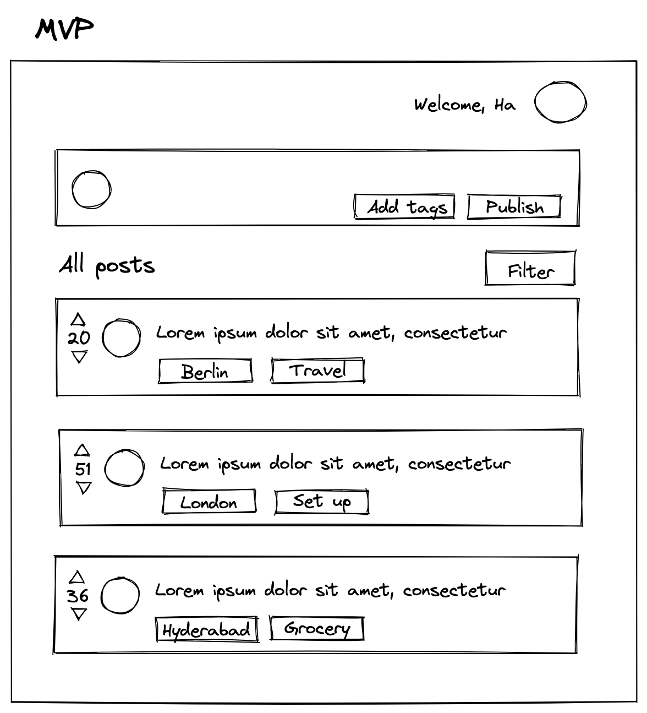

# Tips for CS162 final project
By Ha Tran Nguyen Phuong (M23)

*For a prettier version on Notion: https://sherlockieee.notion.site/Tips-for-CS162-final-project-be624ef56e9146f7865d4c5f1949562e*

💡 **TL;DR:**
1. Divide work clearly.
2. Start coding early.
3. Keep each other accountable. 
4. Help each other out.

## Overview

CS162 Final Project is hard, whether you are good at coding or not. This is because you are working in a team which require more coordination and dependencies, and regardless of how much you know, with software engineering there is always more you don’t know. So treat this as a learning opportunity If you put in efforts, you will learn a lot. 

Here are a few things that will help you along the way. 

## Team organization

1. Have a meeting early on to talk about logistic. Things to consider:
    - What is everyone’s workload and degree of commitment to the project?
        - Minerva is tough and you are in it together. Knowing people’s degree of commitment will help delegate tasks easily later on.
    - What is the MVP?
        - Don’t be too ambitious - scope it as minimally as you can. You can always add things later.
        - Try to make it into a list of requirements that you can check-off.
        - Have a rough drawing as well so everyone can imagine what it is. Here’s what I did for my project:
            
                        
    - What is everyone interested in working on?
        - Think of the skills you want to learn this semester.
    - What is everyone experienced in?
        - This is so you can help each other’s out. E.g. I wanted to learn back-end but have experience with front-end, so was helping front-end team a lot.
        - It’s also good to have a resource section to help people learn!
    - How often do we want to schedule check-ins?
        - Be realistic. We used to schedule weekly check-ins but most people would not be doing work and so the momentum died off early on. Bi-weekly, or even monthly check-ins might be better.
        - Staying 30 minutes after class or 30 minutes before class is often a good time for everyone to meet.
        - Send Calendar invites!
    - How can we keep each other accountable?
        - Deadlines is one thing, but also be creative! Can you schedule co-working session? Can you have team dinner where if someone doesn’t work, they pay for the dinner?
2. Set up a Notion page or another project management tool for task tracking, etc. + communication tool (Telegram).
3. Try to divide the work as clearly as possible. This typically means 2 people front-end, 2-3 people back-end + database, 1 person design/ business/ devops. Afterwards, divide the work by features/ requirements.
4. Have 1 person as point-of-contact i.e. doing project management. 

## Working on project

1. **Start early!!** You can start coding once you scoped out the MVP. If you are trying to learn something new, see point 2.
    - For front-end, even if you don’t have a design yet, you can start building components and add CSS later.
    - For back-end, you can start thinking about database schema and create PostgreSQL database and API endpoints.
    - For dev-ops, start writing CI/CD pipelines, integration tests, Docker containers, etc.
    - For design, have a rough Figma sketch and iterate as you go through the semester.
2. If you are learning a new technology:
    - Think of the task you want to do, learn just enough to start working on it, then learn more as you figure things out along the way.
    - If it helps, have a deadline on what you are learning and stick to it e.g. I will learn the basics of React for 1 week, and then start working on this feature.
    - Google and StackOverFlow is your friend. But also, ask your teammates/ prof/ TA for help.
    - If the entire team is new, choose a really simple technology stack (pure Flask with HTML template in Jinja is better than Flask + React).
3. If you already have experience:
    - Help others in your team. Offer co-working/ pair programming/ etc. Share resources with others on how you learn technology.
    - Help set expectations for newer people e.g. learning HTML/ CSS + a little React is maybe realistic, HTML/ CSS + React + PostgreSQL is probably not.
    - Be ready to take more ownership than you originally sign up for.
4. Align your work with assignments. There’s 1 for front-end pretty early on and 1 for database later that you can swap for working on final project. Use those opportunities so you can both work on final project + skip an assignment!
5. In case it wasn’t emphasized, **start early!!!!!**

## Technical details

1. Tech stack: Flask is the easiest because you will also be learning it in class, but for industry standards, Flask (backend) + React (frontend) might be a better choice. A full Javascript stack (React + Express/ NextJS) might also be good. 
    - Good resources for front-end
        
        Choose 1 of 2:
        
        - FreeCodeCamp (Do HTML, CSS, JavaScript and React sections. The 300 hours is an estimated, it actually is a lot faster.)
        - The Odin Project
    - Good resources for Flask
        
        Do these 2 tutorials. It might be repetitive but it will help your understanding. For Miguel blog, he also has one that connects to React (separate from this) that you might want to try **IF you already know React** (otherwise it will be too much).
        
        - [https://flask.palletsprojects.com/en/2.2.x/tutorial/](https://flask.palletsprojects.com/en/2.2.x/tutorial/)
        - [https://blog.miguelgrinberg.com/post/the-flask-mega-tutorial-part-i-hello-world](https://blog.miguelgrinberg.com/post/the-flask-mega-tutorial-part-i-hello-world)
2. Database: PostgreSQL/ SQLite as a database is pretty standard. MongoDB might work, but classes (& most applications in the real world) focus on SQL databases more.
3. Deployment: We usually use Heroku for deployment but now that it’s not free, check out **Vercel/ Netlify** for front-end and **Railway** for back-end + database deployment. 
4. Working in Git:
    - Always create a new branch and create a pull request to not introduce breaking changes
    - Have clear commit messages
    - Have clear README to help prof and TA understand what’s going on.
    
    (Basically everything you learnt in Session 3).
    
5. Google and Stackoverflow are your best friends. Also look at other people’s Github projects to see how they build something similar to yours. 

*Thanks to Trang Doan and Aniket Das for reading drafts and making comments.*